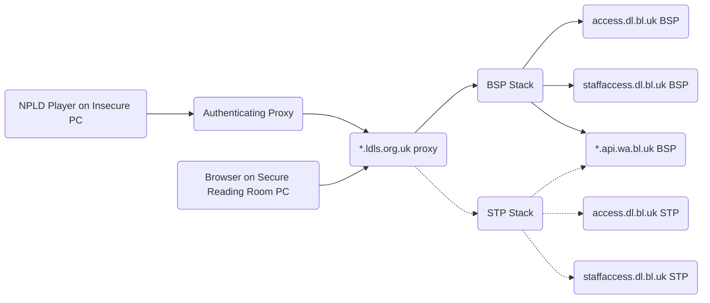
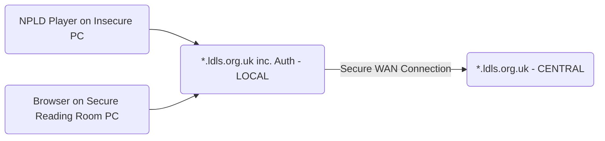

Reading Room Wayback Service Stack <!-- omit in toc -->
==================================


__Note that this is a public repository, as is mirrored on GitHub as [ukwa/npld-access-stack](https://github.com/ukwa/npld-access-stack)__

----

- [Introduction](#introduction)
- [Overview](#overview)
  - [Deployment Architecture](#deployment-architecture)
- [The Central Services](#the-central-services)
  - [Pre-requisites](#pre-requisites)
  - [Operations](#operations)
    - [Deploying and Updating the Stack](#deploying-and-updating-the-stack)
    - [Deploying and Updating the Stack Manually](#deploying-and-updating-the-stack-manually)
    - [Configuring an upstream proxy](#configuring-an-upstream-proxy)
    - [Setting up logging](#setting-up-logging)
    - [Setting up monitoring](#setting-up-monitoring)
    - [Updating the Block List](#updating-the-block-list)
    - [Inspecting and Managing SCU locks](#inspecting-and-managing-scu-locks)
    - [Deployment Testing](#deployment-testing)
- [Access in Reading Rooms](#access-in-reading-rooms)
  - [Via Secure Terminals](#via-secure-terminals)
  - [Via the NPLD Player](#via-the-npld-player)
    - [The NPLD Player Custom URL Protocol](#the-npld-player-custom-url-protocol)
  - [Connection to the Central Services](#connection-to-the-central-services)
  - [Deploying the NPLD Player](#deploying-the-npld-player)
  - [Printing](#printing)
- [Testing](#testing)
- [Monitoring](#monitoring)
- [MI Reporting](#mi-reporting)
- [Ongoing Development](#ongoing-development)

Introduction
------------

This [Docker Swarm Stack](https://docs.docker.com/engine/swarm/key-concepts/) deploys the back-end services required to provide reading-room and staff access to Non-Print Legal Deposit material.

This system provides a web-based access point for every Legal Deposit library, and one more for BL Staff, through which NPLD material can be accessed.  This covers items delivered to us by publishers (supporting eBook and ePub formats at this time), and web pages captured by the UK Web Archive. This system implements the access restrictions required by the NPLD regulations.

This replaces the remote-desktop-based access system by using [UK Web Archive Python Wayback](https://github.com/ukwa/ukwa-pywb) (UKWA PyWB) to provide access to content directly to secure browsers in reading rooms (either directly, or via the forthcoming [NPLD Player](https://github.com/ukwa/npld-player)). The UKWA PyWB system also implements the Single-Concurrent Usage (SCU) locks, and provides a way for staff to manage those locks if needed.


Overview
--------

To ensure a smooth transition, this service maintains the same pattern of localized URLs for accessing content as the current system. e.g.

- https://blstaff.ldls.org.uk/welcome.html?ark:/81055/vdc_100090432161.0x000001
- http://bodleian.ldls.org.uk/ark:/81055/vdc_100090432161.0x000001
- https://bl.ldls.org.uk/welcome.html?10000101000000/http://www.downstairsatthekingshead.com
- https://nls.ldls.org.uk/10000101000000/http://www.downstairsatthekingshead.com _TBC: Is this syntax supported? i.e. no `welcome.html`?_

The items with ARK identifiers are handled by the PyWB `doc` collection that proxies the request downstream to the digital library access service, and the `TIMESTAMP/URL` identifiers are passed to a second `web` collection that 'replays' the archived web pages back using UKWA internal services. NGINX is used to perform the mappings from expected URLs to those supported by PyWB.

For example, if a BL Reading Room patron uses this Access URL to get an URL from the web archive:

- https://blstaff.ldls.org.uk/welcome.html?10000101000000/http://www.downstairsatthekingshead.com

Then the URL will get mapped to this PyWB URL:

- https://blstaff.ldls.org.uk/web/10000101000000/http://www.downstairsatthekingshead.com

Alternatively, if a BL Staff Access URL used to get an eBook from DLS:

- https://blstaff.ldls.org.uk/welcome.html?ark:/81055/vdc_100090432161.0x000001

Then the content will be served from this URL:

- https://blstaff.ldls.org.uk/doc/20010101120000/http://staffaccess.dl.bl.uk/ark:/81055/vdc_100090432161.0x000001

In this case, a fixed timestamp is used for all ARKs and the `http://staffaccess.dl.bl.uk` prefix has been added, as PyWB needs both a timestamp and a URL to get the content and manage the SCU locks. Requests from reading rooms would use `http://access.dl.bl.uk`, e.g. http://access.dl.bl.uk/ark:/81055/vdc_100022588767.0x000002 These URLs are just about how the web service acts as a proxy to the archival store, and are implementation details that do not affect how the service is used, except in that the combined `TIMESTAMP/URI` identifier is the key upon which SCU locks are minted and managed.

### Deployment Architecture

It is expected that the services in this stack are used as the back-end for an upstream proxy.  For example, for the British Library, there is some frontend proxy that the `bl.ldls.org.uk` domain name resolves to. That 'front door' proxy will then pass the request on to the relevant back-end services provided by this service stack, which will be deployed in BSP and STP, and connected up using the existing failover mechanism. This backend system can be used directly from secure reading room PCs, or using the NPLD Player on unsecured reading room PCs.  Note that the back-end setup is the same in either case, as the access restrictions are implemented at the network level, and the NPLD Player authentication is handled upstream.



Note that the web archive is only accessible via the BSP site at present, so will become unavailable if BSP is down and all content is being served via STP. Access to NPLD documents should work fine, as the `*.dl.bl.uk` services are available at both sites.


The Central Services
--------------------

To provide the central services on the _BSP Stack_ and _STP Stack_, each stack runs the following set of services:

- An NGINX service to provide URL management, with a shared port and separate ports for each service. This also includes a [mtail](https://github.com/google/mtail) process used for monitoring the service.
- Seven PyWB services, one for each Legal Deposit Library (BL/NLW/NLS/Bod/CUL/TCD managing SCU locks for each), and one for staff access (no SCU locks).
- A Redis service, which holds the SCU lock state for all the PyWB services.
- A [PushProx](https://github.com/prometheus-community/PushProx) client service, which allows NGINX to be monitored by pushing metrics to a remote [Prometheus](https://prometheus.io/) service via a PushProx proxy.

Each service supports three host names, the production `*.ldls.org.uk` name, a `*-beta.ldls.org.uk` name to run tests while running in parallel with the original system, and a `*-alpha.ldls.org.uk` name accessible only by staff for evaluation of new versions of the service.  When accessed over the shared port, NGINX uses the `Host` in the request to determine which service is being called. Each PyWB service also exposes a dedicated port, but this is intended to debugging rather than production use.


| Server Name           | Beta Server Name            | Shared NGINX Port | Dedicated NGINX Port | Direct PyWB Port (for debugging) |
|-----------------------|-----------------------------|-------------------|----------------------|----------------------------------|
| bl.ldls.org.uk        | bl-beta.ldls.org.uk         | 8100              | 8200                 | 8300                             |
| nls.ldls.org.uk	| nls-beta.ldls.org.uk        | 8100              | 8201                 | 8301                             |
| llgc.ldls.org.uk      | llgc-beta.ldls.org.uk       | 8100              | 8202                 | 8302                             |
| cam.ldls.org.uk       | cam-beta.ldls.org.uk        | 8100              | 8203                 | 8303                             |
| bodleian.ldls.org.uk  | bodleian-beta.ldls.org.uk   | 8100              | 8204                 | 8304                             |
| tcdlibrary.ldls.org.uk| tcdlibrary-beta.ldls.org.uk | 8100              | 8205                 | 8305                             |
| blstaff.ldls.org.uk   | blstaff-beta.ldls.org.uk    | 8100              | 8209                 | 8309                             |


This NGINX setup assumes that any failover redirection, SSL encryption, authentication, token validation or user identification has all been handled upstream of this service stack. 

For testing purposes, a local `/etc/hosts` file can be used to point the `*.ldls.org.uk` domain names to the service stack, allowing the service to be viewed in a web browser. Of course this won't include any of the services that are handled upstream.

### Pre-requisites

In each deployment location:

- One or more Linux servers with Docker installed and running in Swarm mode.
- Network access to:
    - The public web, if only temporarily, install these files and to download the Docker images during installation/deployment.
        - If this is not possible [offline Docker image installation can be used](https://serverfault.com/a/718470).
    - The BL internal nameservers, so `\*.api.wa.bl.uk` service domains can be resolved.
    - The DLS back-end systems where ARK-based resources can be downloaded (e.g. `access.dl.bl.uk`, `staffaccess.dl.bl.uk`).
    - The UKWA back-end systems: 
        - CDX index for URL lookups (`cdx.api.wa.bl.uk`).
        - WARC record retrieval (`warc-server.api.wa.bl.uk`).
        - GitLab where the URL block list is stored ([`git.wa.bl.uk`](http://git.wa.bl.uk/bl-services/wayback_excludes_update/-/tree/master/ldukwa/acl)).
        - If deployed on the Access VLAN, the existing UKWA service proxy can be used to reach these systems.


### Operations

When running operations on the server, the operator should use a non-root user account that is able to use Docker (i.e. a member of the `docker` group on the machine). e.g.

```
[root@demo ~]# useradd -G docker access
[root@demo ~]# su - access
[access@demo ~]$ docker run hello-world
```

All the necessary base software and configuration is documented (internally) at https://git.wa.bl.uk/ukwa/packages/ukwa-npld-access-support-packages .  This includes setting up the GitLab Runner that is used to manage routine deployment and maintenance.

#### Deploying and Updating the Stack

There are three distinct deployment contexts:

- _DEV_: Only available internally at the BL, for early stage development.
- _ALPHA_: Deployed on the IRC systems at the BL, with access to test data only. Available to LDL staff only.
- _BETA_: Deployed on the production system, with access to live data. Available in Reading Rooms.  Once the solution is accepted, this will become the live production system.

Routine deployments will be handled by GitLab CI/CD, as this makes software deployment and configuration much easier. See [`.gitlab-ci.yml`](./.gitlab-ci.yml) for details. 

The GitLab CI/CD deployment to work, there needs to be a shared storage folder with `docker` group write permissions somewhere, and this needs to referenced in the `.gitlab-ci.yml` file along with any other context-dependant configuration. Any sensitive/secret values are also handled through GitLab. At the time of writing, the `/home/axsadmin/service-storage` folder is used across all DLS deployments:

```
mkdir /home/axsadmin/service-storage
# Set up permissions, using setguid to allow users to write files in easily:
chgrp docker /home/axsadmin/service-storage
chmod g+s /home/axsadmin/service-storage
# Also needs parent folder to be accessible to this group:
chgrp docker /home/axsadmin
chmod g+rx /home/axsadmin
```

The GitLab CI/CD pipeline can be seen at https://git.wa.bl.uk/ukwa/services/ukwa-npld-access-stack/-/pipelines - this interface can be used to inspect the automated deployments, and to initiate the manual deployments to IRC and LIVE environments.

Note that this deployment uses GitLab's [Dependency Proxy](https://docs.gitlab.com/ee/user/packages/dependency_proxy/) feature to download and cache the required Docker images. Crucially, the CI/CD job credentials are used to authorize access to the Dependency Proxy, and these are only valid for the duration of the job. Therefore, Docker cannot pull images outside this time, unless you explicitly do a `docker login git.wa.bl.uk:443 ...`.  This is why it is important that the Docker Stack starter script waits for the Stack to spin up.

#### Deploying and Updating the Stack Manually

If manual deployment is required, it works as follows. 

First get the `ukwa-services` repository and change to the relevant directory:

```
 git clone https://github.com/ukwa/ukwa-services.git
 cd ukwa-services/access/rrwb
 ```

The Swarm deployment needs access to an host drive location where the list of blocked URLs is stored.  The `deploy-rrwb-dev.sh` script shows an example of how this is done for the UKWA DEV system:  

```
#!/bin/sh

# Where to store shared files:
export STORAGE_PATH_SHARED=/mnt/nfs/data/airflow/data_exports

# Username and password to use to access the locks pages:
export LOCKS_AUTH=demouser:demopass

# Which version of PyWB to use:
export PYWB_IMAGE=ukwa/ukwa-pywb:2.6.4

# Deploy as a Docker Stack
docker stack deploy -c docker-compose.yml access_rrwb
```

A similar deployment script should be created for each deployment context, setting the `STORAGE_PATH_SHARED` environment variable before deploying the stack, and setting the `LOCKS_AUTH` username and password as required.

Before running the deployment script, a copy of the URL block access control list should be placed in your shared folder, as per the [Updating the Blocks List section below](#updating-the-block-list).  Once that's in place, you can run your script to deploy the services.

Assuming the required Docker images can be downloaded (or have already been installed offline/manually), the services should start up and start to come online. In a few moments, you should see:

```
[access@demo rrwb]$ docker service ls
ID             NAME                     MODE         REPLICAS   IMAGE                  PORTS
8de1fqo812x2   access_rrwb_nginx        replicated   1/1        nginx:1-alpine         *:8100->8100/tcp, *:8200-8205->8200-8205/tcp, *:8209->8209/tcp
0nrr4jvzo1z5   access_rrwb_pywb-bl      replicated   1/1        ukwa/ukwa-pywb:2.6.4   *:8300->8080/tcp
oce47sczlkbi   access_rrwb_pywb-bod     replicated   1/1        ukwa/ukwa-pywb:2.6.4   *:8304->8080/tcp
pbhou0zmso6f   access_rrwb_pywb-cam     replicated   1/1        ukwa/ukwa-pywb:2.6.4   *:8303->8080/tcp
a1ixwrebslj0   access_rrwb_pywb-llgc    replicated   1/1        ukwa/ukwa-pywb:2.6.4   *:8302->8080/tcp
oczh6d2c4oh8   access_rrwb_pywb-nls     replicated   1/1        ukwa/ukwa-pywb:2.6.4   *:8301->8080/tcp
lddlkbb80ez7   access_rrwb_pywb-staff   replicated   1/1        ukwa/ukwa-pywb:2.6.4   *:8309->8080/tcp
9s1wyzmlshx0   access_rrwb_pywb-tcd     replicated   1/1        ukwa/ukwa-pywb:2.6.4   *:8305->8080/tcp
e54xnbxkkk14   access_rrwb_redis        replicated   1/1        redis:6
```

Where all service replicas are `1/1`. If any are stuck at `0/1` then they are having trouble starting, and you can use commands like `docker service ps --no-trunc access_rrwb_nginx` to check on individual services.

If the `docker-compose.yml` file is updated, the stack can be redeployed in order to update the Swarm configuration. However, note that most of the specific configuration is in files held on disk, e.g. the NGINX configuration files. If these are changed, the services can be restarted, forcing the configuration to be reloaded, e.g.

    docker service update --force access_rrwb_nginx
    
In case things seem to get into a confused state, it is possible to completely remove the whole service stack and then redeploy it, e.g.

```bash
docker stack rm access_rrwb
# Wait a couple of minutes while everything gets tidied up, then 
./deploy-rrwb-dev.sh
```

#### Configuring an upstream proxy

First, on the deployment server ensure the required ports are accessible:

```
# Shared port:
sudo firewall-cmd --add-port=8100/tcp --permanent
# Individual ports:
sudo firewall-cmd --add-port=8200/tcp --permanent
sudo firewall-cmd --add-port=8201/tcp --permanent
sudo firewall-cmd --add-port=8202/tcp --permanent
sudo firewall-cmd --add-port=8203/tcp --permanent
sudo firewall-cmd --add-port=8204/tcp --permanent
sudo firewall-cmd --add-port=8205/tcp --permanent
sudo firewall-cmd --add-port=8209/tcp --permanent
# Metrics:
sudo firewall-cmd --add-port=8309/tcp --permanent
```

Any upstream proxy talking to these services need to set the host and protocol/scheme so that any URLs returned are correct. e.g. for Apache use `ProxyPreserveHost` set to `on` (default is `off`) to set the `Host` header, and use `X-Forwarded-Proto` to specify whether the protocol/scheme is `http` or `https`.

From the reading rooms, each LDL will have to set up the DNS names that resolve to a suitable user-facing upstream proxy. That proxy then passes the requests on to the other systems in the chain.  An example _Apache HTTPD_ server configuration can be found in [the `deployment/apache` folder](./deployment/apache/).

#### Setting up logging

_TBA: How should logging be set up, for MI and for security?_

Currently, the stack extracts Prometheus metrics from web access logs as they stream past, and all the actual log files are managed by Docker.

If we need to keep access log files from NGINX for analysis, there are various options:

- Change Docker to write logs to files, and do log rotation like [this](https://www.digitalocean.com/community/tutorials/how-to-configure-logging-and-log-rotation-in-nginx-on-an-ubuntu-vps).
- Push logs to Logstash and use it to make dated log files.
- Push all Docker logs to a syslog server (okay for security, not much use for M.I.).

_The precise details depend on how M.I. integration works._


#### Setting up monitoring

The NGINX metrics are exposed on port 3903, and also accessible via a Prometheus instance on port 3990.  These metrics can be fetched and forwarded using GitHub Runners, or if permitted by the security team, accessed via dedicated firewall rules.

The Web Archive team can configure their monitoring services to gather metrics from the live service. There should not be any further setup required.

#### Updating the Block List

The list of URLs that are blocked from access in the Reading Rooms needs to be installed when deploying the service, and will need to be updated periodically (when the web archive team receives take-down requests).

The blocks list is version controlled and held in: http://git.wa.bl.uk/bl-services/wayback_excludes_update/-/tree/master/ldukwa/acl

It needs to be downloaded from there on a regular basis. e.g. a daily cron job like:

    curl -o /shared-folder/blocks.aclj http://git.wa.bl.uk/bl-services/wayback_excludes_update/-/raw/master/ldukwa/acl/blocks.aclj

#### Inspecting and Managing SCU locks

The UKWA PyWB system includes [an improved version of the SCU locking mechanism](https://github.com/ukwa/ukwa-pywb/blob/master/docs/locks.md#single-concurrent-lock-system).  When an item is first retrieved, a lock for that item is minted against a session cookie in the secure browser. This initial lock is stored in Redis and set to expire at the end of the day.

However, while the item is being access, a JavaScript client is used to update the lock status, and changes the expiration of the lock to be five minutes in the future. This lock is refreshed every minute or so, so keeps being pushed back into the future while the item is in use. Once the item is no longer being used, the lock updates stop, and the lock is released shortly afterwards. This mechanism is expected to release item locks more reliably than the previous approach.

See [the Admin Page documentation](https://github.com/ukwa/ukwa-pywb/blob/master/docs/locks.md#admin-page-and-api) to see how to access and manage the SCU locks.

Access to this page is managed by HTTP Basic authentication via the `LOCKS_AUTH=username:pw` environment variable that must be set on launch.


#### Deployment Testing

While proper testing needs to be done from the end user perspective, basic testing of the deployed services can be use to check the basic functions and connectivity are in place.

For the web archive:

- http://host:8209/web/19950418155600/http://portico.bl.uk/

For the documents:

- http://host:8209/doc/20010101120000/http://staffaccess.dl.bl.uk/ark:/81055/vdc_100090432161.0x000001
 
Each service has a special HTML page with some example documents.  The _Beta_ service has a `test_beta.html` file pointing to production data examples, e.g.

<https://blstaff-beta.ldls.org.uk/test_beta.html>

The _Alpha_ service pointing to test data examples is `test_alpha.html`, e.g.

<https://blstaff-alpha.ldls.org.uk/test_alpha.html>


Access in Reading Rooms
------------------------

How access works depends on the terminals in use.  The critical constraint is that we need to maintain the NPLD regulations restrictions, including single-concurrent use, which means readers must not be able to take away copies. This requires either locked-down access terminals, or limiting access via a dedicated application called the NPLD Player.

### Via Secure Terminals

In reading rooms with locked-down access terminals, readers may access the central services directly in the access terminal's web browser.

In this case, the domain name of the relevant service, e.g. nls.ldls.org.uk, should be the IP address of the machine acting as the `ldls.org.uk proxy`?  Or does the DNS name refer directly to the BSP or STP Stack?

Access to that IP address should be managed at the network and firewall level. Only official Reading Room IP addresses should be able to access the services. For services outside the British Library, access to the central services is enabled by the DLS Access VLAN, which spans all BL/LLGC/NS properties.


### Via the NPLD Player

In reading rooms without locked-down terminals, readers must use the NPLD Player to access content.  This means deploying two components:

- the [NPLD Player](https://github.com/ukwa/npld-player) on reading room terminals, including a bundled secret key that the Player will use to authenticate itself. These builds are available from [here](https://github.com/ukwa/npld-player-builds) for staff only (get in touch with any UKWA staff member if you need access rights).
- the authenticating proxy, that checks the secret key, and proxies the requests on to the central services.

There are two possible deployment patterns, depending on whether the library in question is directly peered onto the DLS Access VLAN, or uses a remote outbound proxy to connect to the central services.

In both cases, an additional proxy configuration is required for the client IP address range corresponding to the reading rooms where the NPLD Player will be used.  This additional proxy configuration should check the secret key is present. If not, it should present a web page that will redirect the user to the NPLD Player via the custom protocol scheme.

If the secret key is verified, the request should be proxied on towards the central services. For reading rooms with access to the DLS Access VLAN, the request should be proxied onwards in the same way as for secure terminals.

For reading rooms without access to the DLS Access VLAN, the request should be proxied onwards to the Outbound Proxy that securely connects to the central services over the internet.  This should only need a single Linux VM in each network area. For incoming connections, this would handling NPLD Player authentication or provide access depending on client IP ranges, and would pass outgoing connections on the the central services using the appropriate TLS certificates and access keys.

No further URL rewriting or other complicated configuration should be required, as and such manipulations should now be managed centrally.

#### The NPLD Player Custom URL Protocol

However, to order to make sure users can get to the content using the NPLD Player, some additional work is required.

The user journey starts with a URL for a NPLD item, found via a library discovery service. As described above, they look like this:

    https://bl.ldls.org.uk/ark:/81055/vdc_100031420983.0x000001

If the user is not on a secure PC (likely identified by their IP address), then the user cannot be shown the content. If they are on a machine that has the NPLD Player installed (again, identified by IP address), they can be redirected to access the content via that application.  This is done using a custom URL scheme, i.e. instead of a `http` URL, the user should be presented with a URL with a `npld-viewer` URL, like this:

    npld-viewer://ark:/81055/vdc_100031420983.0x000001

i.e. the whole host prefix `https://bl.ldls.org.uk/` has been replaced with `npld-viewer://`. This special URL scheme is registered by the NPLD Player when it is installed. Hence, when clicking on this link, the URL will be passed to the player, which will look up content item using the given identifier.

The user will then be able to access the item. 

Note that if the user hits another URL that is not part of the document in question, or part of the archived web if that is the content being accessed, the user will be 'bounced' into the computer's default browser in order to continue.

### Connection to the Central Services

Both modes of access depend on the Central Services being available. The national libraries of Scotland and Britain should all be able to access the central services directly via the DLS Access VLAN, but the otherlibraries, and any library wishing to use the NPLD Player, will need to deploy an additional proxy server locally:



The role of this server is to proxy user requests to the central services over the _Secure WAN Connection_. This is expected to be an NGINX instance that verifies the source IP addresses, handles the validation of the NPLD Player secure token, and sets up the ongoing secure connection to the central services (secured via SSL certs and a shared secret as per the original design).  This should not require a lot of resources, e.g. a Linux server with 2GB of RAM and at least 2 CPUs. 

### Deploying the NPLD Player

Where Readers are expected to use the NPLD Player, this will need to be installed on the appropriate access terminals.

Installation packages, built with the secret access token bundled inside, will be made available via this _private_ GitHub repository: https://github.com/ukwa/npld-player-builds  The intention is that configuration common to all libraries will be held there and embedded in the distribution package. This includes the authentication token, as it has to be hardcoded into the application.  It will be the responsibility of the deploying library to ensure that the bundled secret access token is accepted by the local authenticating proxy.

To access the builds repository, you need to be a member of the _LDL Tech_ team on the UK Web Archive's GitHub account. To be added to this team, please contact the UK Web Archive directly or via another British Library staff member.

It is also necessary to perform some additional configuration locally in order to ensure the NPLD Player knows what service to talk to. This setting is different in every library, so is configured via environment variables, e.g. for the _Alpha_ service for the National Library of Scotland:

```
NPLD_PLAYER_PREFIX=https://nls-alpha.ldls.org.uk/
NPLD_PLAYER_INITIAL_WEB_ADDRESS=https://nls-alpha.ldls.org.uk/
```

Optional features link printing can also be controlled locally in a similar way. For more information see the documentation at: https://github.com/ukwa/npld-player#deployment

Note that as with the previous solution, the secure deployment of the NPLD Player is critically dependent on the careful management of the Outbound Proxy that links back to the centralized services.  This should be locked down so that it can only be used from IP ranges that correspond to reading rooms, and that the IP range corresponding to reading rooms without locked-down terminals is also configured to require the secure token header, thus ensuring only the NPLD Player can access the material.

### Printing

Printing should work exactly the same as for any other web page being viewed in the reading room. When the NPLD Player is in use, this will act like any other application on the machine, and use on the local print system via standard OS calls.

Note that to avoid copies of material being taken away, libraries should not allow `Print to file`.

## Testing

_...TBA: Add routine testing via Robot Framework? Is that possible given the deployment context?_

The formal User Acceptance Testing script for this system is available via the LDL Teams site hosted by the BL. [This link](https://bluk.sharepoint.com/:f:/s/PRJ_LDLTechnicalGroup/Ep4fjZQwupVEhSal19TleyABRGRIcKpD3RRuI2ee1k8Rvw?e=0h7MeQ) should take you to the right folder if you are allowed to access it.

## Monitoring

_...TBA: Any notes on current monitoring setup.  The Web Archive currently uses Prometheus to monitor services, but this is 'pull-based', meaning our Prometheus server makes calls to the services it is monitoring, rather than the services posting data to it.  Our current DLS setup is able to pull data from internal systems, but it is not possible to proxy connections the other way. However, it seems [PushProx `prom/pushprox:v0.1.0`](https://github.com/prometheus-community/PushProx) provides a standard way to handle this situation. This should allow service metric monitoring for the central services._

_It would be nice to extend this to the local proxies, either directly monitoring the far-end NGINX services and/or using a `cron` job to ping back to the central services Prometheus instance._

_In principle, this could be extending to running Robot Framework tests every morning, and reporting that all is well, or not._

## MI Reporting

It should be possible to analyse the NGINX logs to gather the information we need.  This could be done for local proxies or for the central services, ideally both so that one can act as a check for the other.

_...TBD: logging locally, including turnaway details, and setup a data feed back to BL? Or a modified version of current MI logging?_ _How are turnaways identified?_

_...TBA: Some information on how this works at present..._

_...TBA: Some information on whether/how individual user sessions should be identified..._


## Ongoing Development

These services need to be kept up to date for security reasons, e.g. browser updates for the NPLD Player and so on. There are also many more formats than ePub and PDF that we need to find ways to support over time.  Therefore, it is expected that we will be dedicating resources to the ongoing development of this service.

Overall, the UK Web Archive team will be responsible for this service. This includes coordinating with any third-party developers, working with internal teams to support deployment, etc.

However, the precise details of how this work is funded and managed across the Legal Deposit libraries need to be worked out. These include:

- Where and how to capture/manage/prioritize the feature backlog. (e.g. an LDL committee)
- Who will manage/oversee the development roadmap. (i.e. who is the Product Owner.)
- How will releases be managed/rolled-out across LDLS.